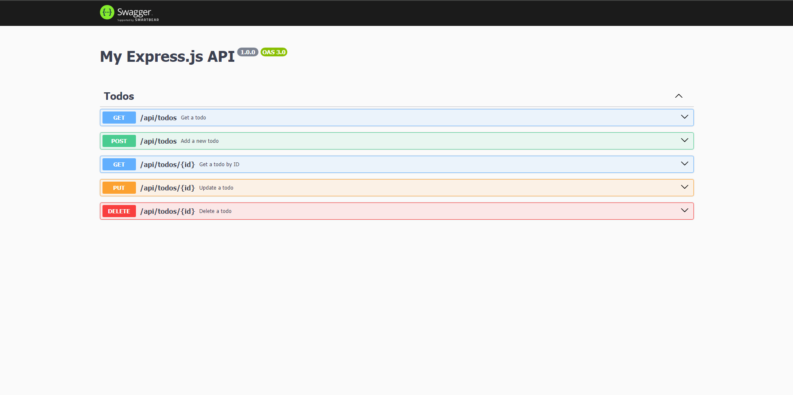

## 📋 TODO
This is a simple Todo API built using Node.js and Express.js. It implements basic CRUD (Create, Read, Update, Delete) 

## 🚀 Features
- **GET** `/todos`: Fetch all todo tasks.
- **GET** `/todos/:id`: Retrieve a specific todo task by its id
- **POST** `/todos`: Add a new todo task.
- **PUT** `/todos/:id`: Update todo task
- **DELETE** `/todos/:id`: Delete todo tasks.
- **Swagger Documentation**: API documentation available at /api using Swagger UI for easy API interaction.


### 📸 Preview


### 🛠️ Technologies Used

- **Node.js**: JavaScript runtime for building the API.
- **Express.js**: Web framework for handling HTTP requests.
- **Swagger UI Express**: For API documentation and testing.

### 🔧 Installation

1. Clone the repository:
   ```sh
   git clone https://github.com/boypirunporn/node-todo-api.git  
   ```
2. Navigate to the project folder:
   ```sh
   cd node-todo-api  
   ```
3. Install dependencies:
   ```sh
   npm install  
   ```
4. Start the development server:
   ```sh
   npm start
   or
   yarn start  
   ```
